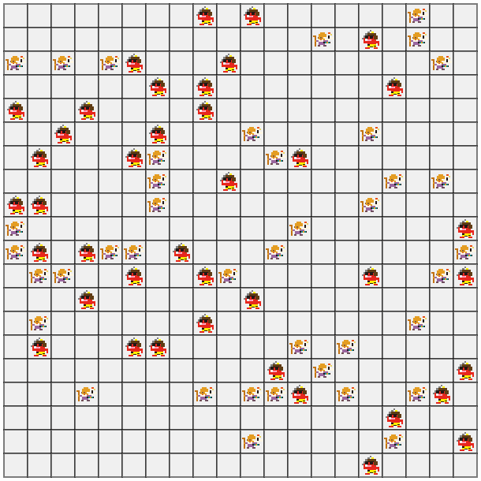

# ポートフォリオ
(2025年4月時点)

# プロフィール

大阪公立大学工業高等専門学校 第4学年 
[GitHub](https://github.com/r-1317/) 
[AtCoder](https://atcoder.jp/users/r1317) (緑/青)

# 経験等
## AtCoder
[https://atcoder.jp/users/r1317](https://atcoder.jp/users/r1317) 
アルゴリズムは緑で、ヒューリスティックは水色 
主にヒューリスティックに力を入れている 

### 例: AHC042の解法
より少ない手数で、福神を落とさずに鬼をすべて落とすという問題 
[chokudaiサーチ](https://chokudai.hatenablog.com/entry/2017/04/12/055515)を使用した。 
結果は273位(1027人中) 
 
[https://atcoder.jp/contests/ahc042/submissions/62337542](https://atcoder.jp/contests/ahc042/submissions/62337542)

<!-- ToDo: 例の追加(AHC036?) -->

## AtCoder Junior League 2024 Summer
### アルゴリズム部門
- 高3個人部門　63位 (大阪3位)
- 高校部門　22位 (大阪1位)

### ヒューリスティック部門
- 高3個人部門　13位 (大阪1位)
- 高校部門　15位 (大阪1位)

[https://atcoder.jp/contests/ajl2024summer](https://atcoder.jp/contests/ajl2024summer)

# 経験・スキル・資格など

## プログラミング言語

- **Python** 
  AtCoder等で使用

<!-- - **C言語** 
  学校の授業で習うレベル -->

## ソフトウェア (ウェブサービス)
- **Git/GitHub** 
  最低限の基本的な操作ができる

- **VSCode** 
  普段からプログラミングに使用している

- **Windows** 
  学校用ノートPCで使用

- **Linux Mint** 
  自宅のデスクトップPCで使用

## 資格など
- TOEIC L&R 815 点取得

# 成果物等

- **AtCoderで提出したコード群** 
  [https://github.com/r-1317/AtCoder](https://github.com/r-1317/AtCoder)

<!--
-   **任意の文字列を先頭にもつ電子掲示板のトリップを生成するプログラム** -2023年7月 完成 
  [https://github.com/r-1317/portfolio2/blob/main/tripkey.ipynb](https://github.com/r-1317/portfolio2/blob/main/tripkey.ipynb)
-->

- **オセロAI** 
  [https://github.com/r-1317/othello](https://github.com/r-1317/othello) 
  MiniMax法, Alpha-Beta法を用いた古典的AI

<!-- -   **高専祭の展示物** (2年生) 
  単語リストの作成を担当 
  [https://yyf999999999.github.io/typingprot/pages/difficultySelecter.html](https://yyf999999999.github.io/typingprot/pages/difficultySelecter.html) -->
 
-  **ThreadConnector** -2023年12月 完成 
  [https://github.com/r-1317/ThreadConnector](https://github.com/r-1317/ThreadConnector) 
  電子掲示板の複数partに別れたスレッドを結合するプログラム

<!--
-  **Recall-Signature-Calculator** -2024年2月 完成 
  [https://github.com/r-1317/Recall-Signature-Calculator](https://github.com/r-1317/Recall-Signature-Calculator) 都道府県知事・市町村長の解職請求に必要な署名数を計算するプログラム。
-->
